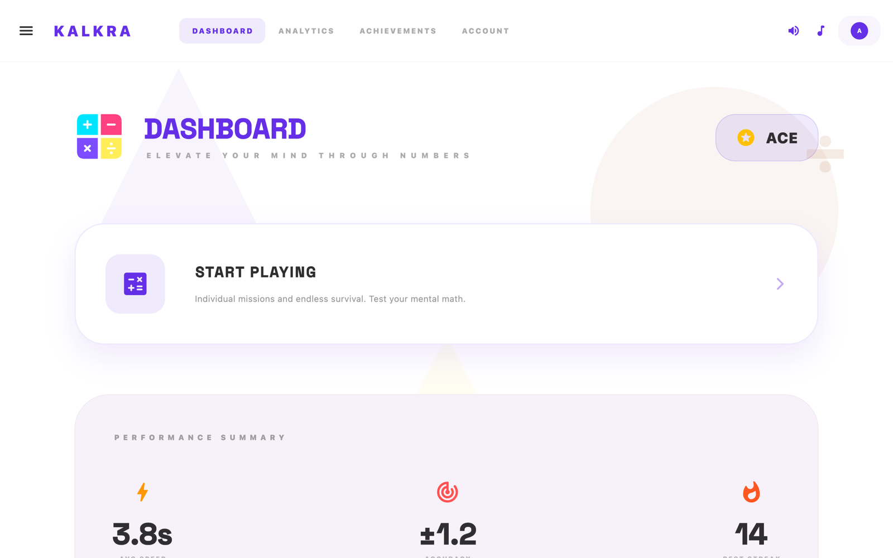
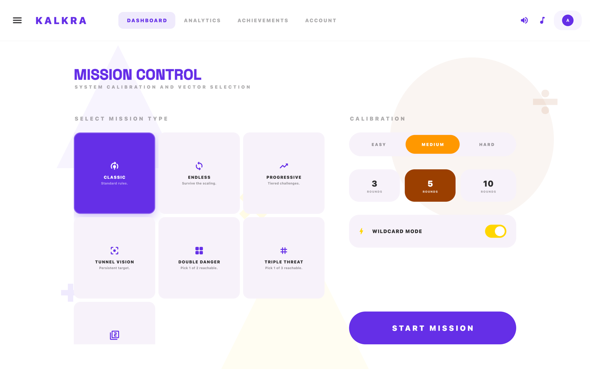
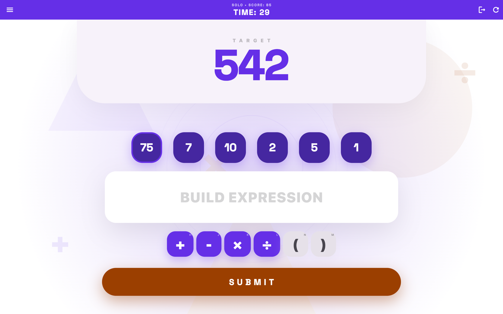
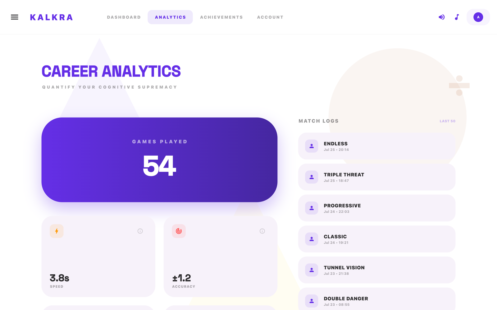
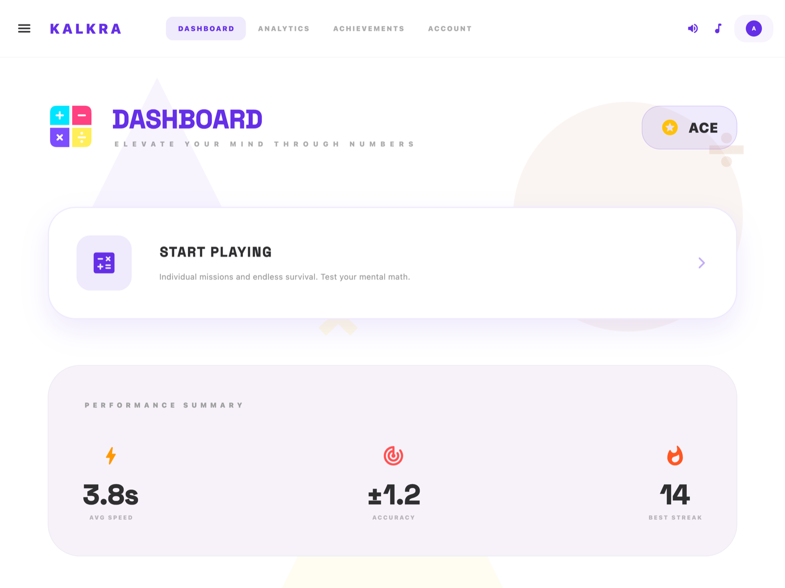
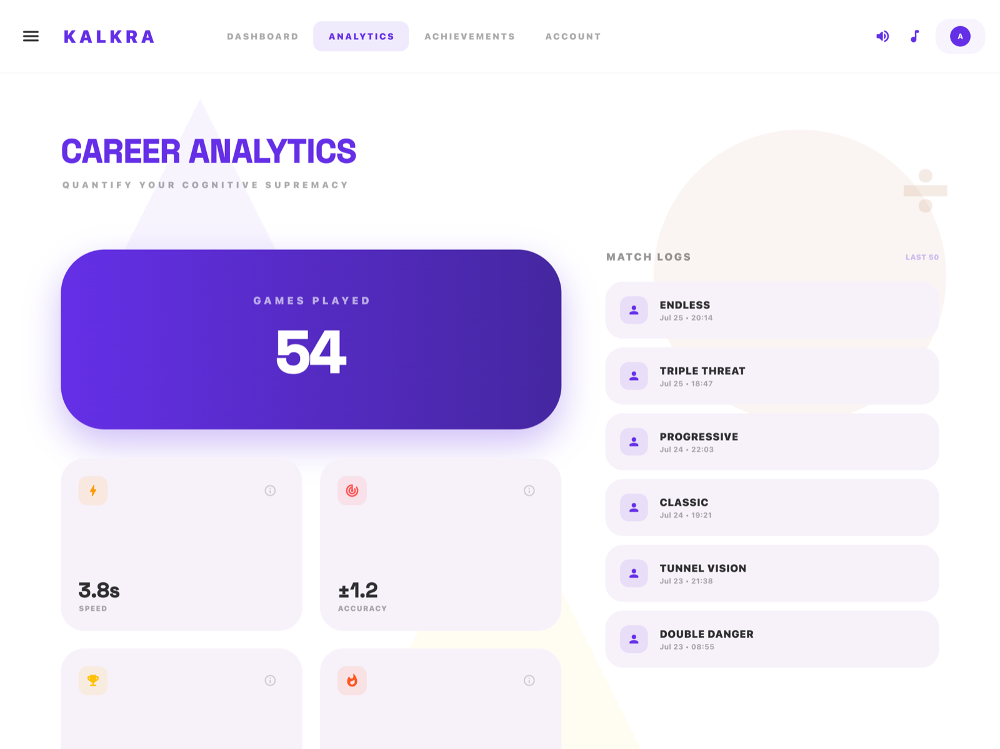
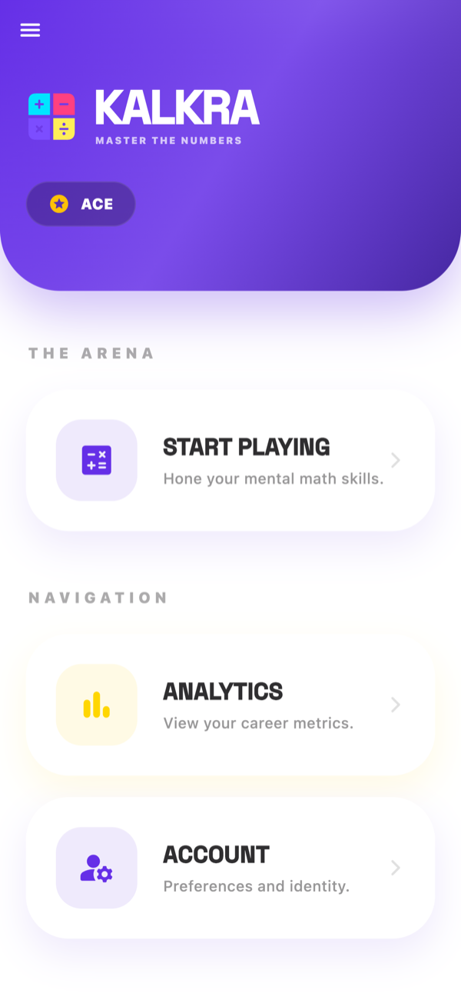
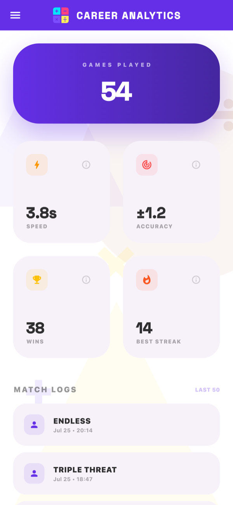

# Kalkra

Kalkra is a single-player Flutter math game targeting the Mac App Store, iOS App Store, and Microsoft Store. Players use a small pool of numbers and the operators `+`, `-`, `*`, and `/` to reach a target. The repository is split into a main Flutter app, a reusable Dart game engine, transport packages preserved for future multiplayer, and a small Dart playtest server.

The app is fully offline in store builds — zero network calls, no accounts, no tracking. Multiplayer is a placeholder ("Coming Soon") and is not active in any store build.

## Screenshots

One responsive Flutter UI ships to all four stores. These shots come from the
store submission captures, grouped by form factor.

### Desktop

<table>
  <tr>
    <td width="50%"></td>
    <td width="50%"></td>
  </tr>
  <tr>
    <td width="50%"></td>
    <td width="50%"></td>
  </tr>
</table>

<sub>Captured on macOS (Mac App Store). The Microsoft Store build renders the same layout. Screens: Dashboard · Mission Control · Gameplay · Career Analytics.</sub>

### Tablet

<table>
  <tr>
    <td width="50%"></td>
    <td width="50%"></td>
  </tr>
</table>

<sub>Captured at iPad Pro 13" landscape (iOS App Store); Google Play tablets render the same layout. Tablets run landscape by default and get the roomy desktop-style layout — resize or split-screen below 1024dp and the phone layout takes over automatically.</sub>

### Phone

<table>
  <tr>
    <td width="50%" align="center"></td>
    <td width="50%" align="center"></td>
  </tr>
</table>

<sub>Captured at iPhone 6.9" (iOS App Store). The Google Play phone build renders the same layout at a narrower width.</sub>

## Quick Start

Prerequisites:

- Flutter and Dart compatible with the SDK constraints in each `pubspec.yaml`.
- Platform tooling for the target you want to run (Xcode for macOS/iOS, Visual Studio for Windows).

Run the app:

```powershell
cd kalkra
flutter pub get
flutter run
```

Run package tests:

```powershell
cd packages/game_engine
dart pub get
dart test
```

There is no checked-in workspace manifest at the repository root. Run `pub get`, `analyze`, and `test` per package. Use `flutter` commands for Flutter packages and `dart` commands for pure Dart packages.

### Store Release Builds

```powershell
# macOS (App Sandbox enabled)
flutter build macos --release

# iOS
flutter build ipa --release --obfuscate --split-debug-info=build/debug-info

# Windows (MSIX)
flutter build windows --release
```

## Repository Layout

- `kalkra/` — main Flutter app: solo play, persistence, audio, themes, and UI. Fonts are bundled (Space Grotesk, Plus Jakarta Sans, DM Sans, IBM Plex Sans, Nunito Sans, Newsreader, Literata, Inter).
- `packages/game_engine/` — pure Dart gameplay logic: number and target generation, solver, validation, scoring, match/session/career helpers, achievements, and Elo.
- `packages/transport_interface/` — shared event models. Compiled into the app via `NullTransport`; no network activity is generated.
- `packages/themer_sdk/` — Flutter theming helper that parses `.themer` JSON into `ThemeData`.
- `packages/transport_lan/` — LAN WebSocket transport. In the repo, **not compiled into store builds**; preserved for future multiplayer.
- `packages/gatekeeper_rate_limit/` — token-bucket rate limiter. In the repo, **not compiled into store builds**.
- `packages/qr_secure_handshake/` — QR handshake package. In the repo, **not compiled into store builds**.
- `playtest_server/` — Dart Shelf server for hosting a Flutter web playtest build and collecting result submissions in SQLite.
- Root docs: `ARCHITECTURE.md`, `PRIVACY_POLICY.md`, `PLAYERS_GUIDE.md`, `SINGLE_PLAYER_PIVOT.md`, and release/planning notes.

## Gameplay Modes

The engine exposes `practice`, `endless`, `progressive`, `tunnelVision`, `permutations`, `powersOf2`, `tripleThreat`, and `doubleDanger` modes. Multiplayer mode is a UI placeholder only.

- **Practice** — one target from six visible numbers.
- **Endless** — starts easy, increases difficulty over time, tracks lives.
- **Progressive** — a fixed ladder of round variants including gauntlet, forbidden number, two targets, expanding pool, mandatory number, and countdown.
- **Tunnel Vision** — one persistent target while the number pool refreshes each round.
- **Permutations** — multiple submissions allowed; equivalent expressions are canonicalized.
- **Powers of 2** — specialized number pool and target type.
- **Triple Threat** — nine targets; **Double Danger** — four targets. A solvable subset is marked by the engine.

Wildcard modifiers can add speed pressure, operator lockout, or double-or-nothing scoring outside progressive mode.

Rules are engine-owned: submitted expressions may only reuse numbers from the pool, constraints are checked per round, division by zero is rejected, and normal rounds require integer intermediate results unless the round allows fractions.

## Architecture

The app is intentionally thin around the game rules. `game_engine` is the source of truth for generated rounds, solver checks, scoring, and match state. The Flutter app consumes those models through Riverpod providers and screen controllers.

For set-length matches, `MatchManager` pre-computes all rounds before play starts. Endless mode appends generated batches in the background. Heavier generation work runs in Dart isolates via `compute()` to keep the UI thread free.

## Playtest Telemetry

Telemetry is gated behind a compile-time flag and is never active in store builds:

```powershell
cd kalkra
flutter build web -t lib/playtest_main.dart --dart-define=PLAYTEST_BUILD=true
```

Copy `build/web` into `../playtest_server/web`, then:

```powershell
cd ..\playtest_server
dart pub get
dart run bin/server.dart
```

The server listens on `PORT` or `8000` and writes `results.db` in the `playtest_server` directory. It exposes:

- `POST /api/results` — records player name, mode, difficulty, score, round count, timestamp, and metadata.
- `GET /api/stats` — returns the latest 100 stored results.

## Multiplayer (Future)

The complete LAN multiplayer implementation is preserved at git tag `multiplayer-baseline` (commit `de0448c`). Recover any file with:

```
git show multiplayer-baseline:<path>
```

The `packages/transport_lan`, `packages/gatekeeper_rate_limit`, and `packages/qr_secure_handshake` directories remain in the repo untouched. They are simply not compiled into the store app. When multiplayer returns, branch from the tag and address the security findings documented in `SECURITY_ANALYSIS.md` before re-enabling.

## Verification

```powershell
cd packages/game_engine
dart test

cd ..\..\kalkra
flutter test
```

There is no root-level test runner. A full sweep runs `pub get`, `analyze`, and `test` in the app and each package that has a `test/` directory.

## Documentation Caveats

- The root does not define a single workspace manifest; commands are run per package.
- Some package descriptions in `pubspec.yaml` are still template text.
- Playtest web builds are solo-oriented and submit results to the relative `/api/results` endpoint when `PLAYTEST_BUILD=true` is set.
